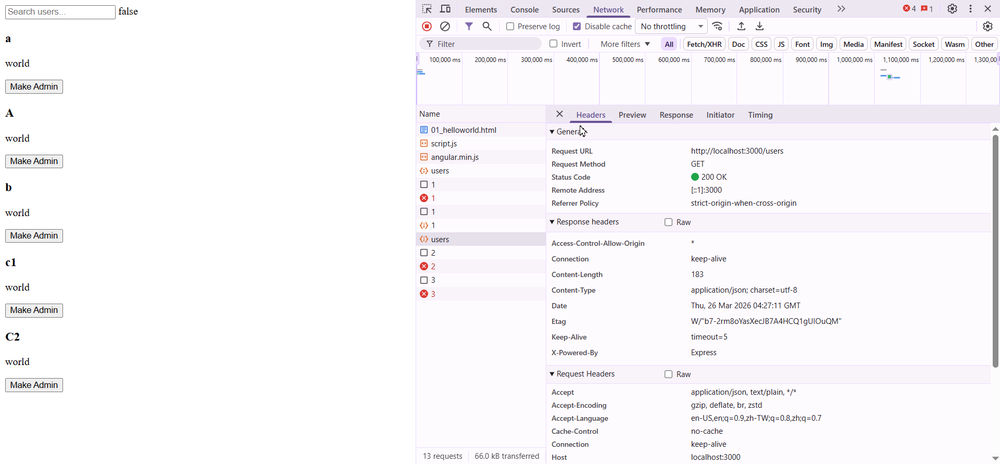
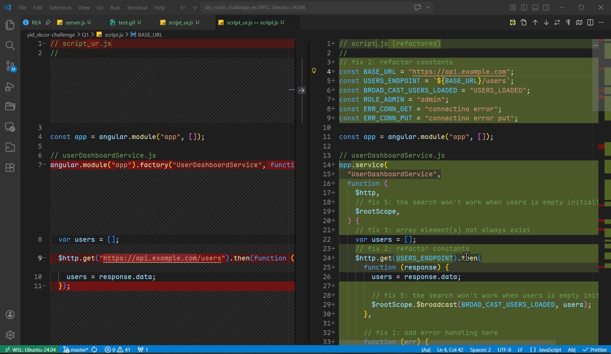

# Comment:

louis: The things that value to the review is keeping minimum delta but works.

correction summary:

// fix 1: add error handling here

// fix 2: refactor constants

// fix 3: array element(s) email not always exist

// fix 3: array element(s) name not always exist

// fix 3: array element(s) not always exist

// fix 4: possibly lacking `toLowerCase` for query if case ignoring is wanted

// fix 5: the search won't work when `users` is empty at first landing

// fix 5: the search won't work when `users` is empty initially

// fix 7: error handling of put request, `404` may be ?

// fix 8: optional loading incidator may be better

// fix 9: simplify matching mechanism

## test

```bash
# change the base_url to localhost:3000 (./scripts.js)
$ npm run start
```



## Please diff and see the correction applied


