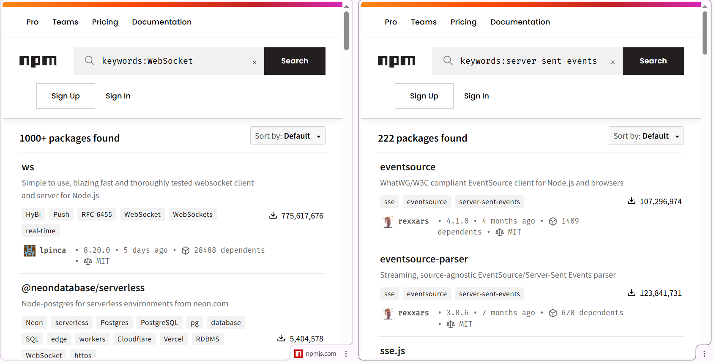

# Q2Frontend

This project was generated with [Angular CLI](https://github.com/angular/angular-cli) version 16.2.16.

please see _docs for some sample screen capture

## start Development server

### backend

```bash
$ npm i # install dependecies
$ npm run start
```

### backend (test)

```bash
# after backend dev server started,
# open another terminal
$ npm run test
```

### frontend

```bash
$ npm i # install dependecies
$ npm run start
# browse http://localhost:4200
```

## Build (production)

### backend

backend is a sole node(js) + express solution. so no need to build.

```bash
$ npm run start
```

### frontend

```bash
$ npm install -g http-server
$ npm i # install dependecies
$ npm run serve
# browse http://localhost:8080
```

> In your README.md, answer these questions:

1. Which real-time approach did you choose and why? What are the trade-offs you considered?

   A: websocket, compared to another codes seems more popular and plenty of libraries. given that there are no show-stopper for the websocket i will choose websocket (the more library available the less chance we hit the wall(problem))
   

1. The priority-based eviction logic — how would this change if we needed to persist events to a database?
   What would you change in the architecture?

   A: depends, redis may be a good choice

1. If this needed to handle 10,000 connected clients, what would break first and what would you change?

   A: i think the backend should break first. (server loading (10000) clients)
   I think i will keep try using the smallest change to the current coding but i will employ the HA/threaded(pm2) solution. given that those solution employed i will change the current `id` field to `uuid` for cross thread consistency.

1. What did you intentionally leave out that you would add for production?

   A:

   // TODO: better general error handling, need further clarification. may be 500 ?

   // TODO: refactor backend server port `3000` to environment variable ? docker ?
