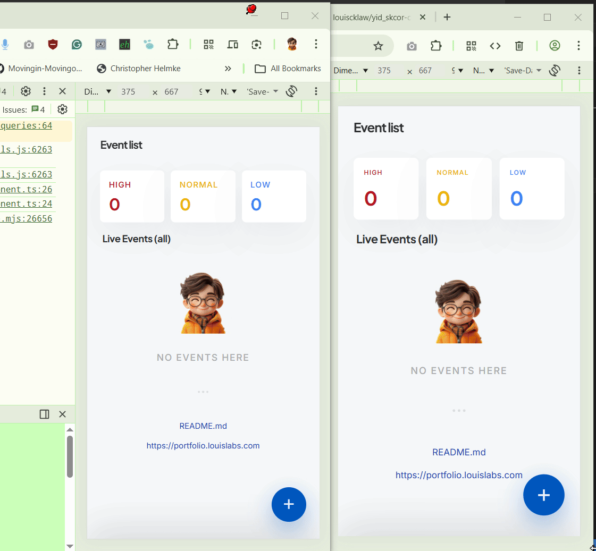
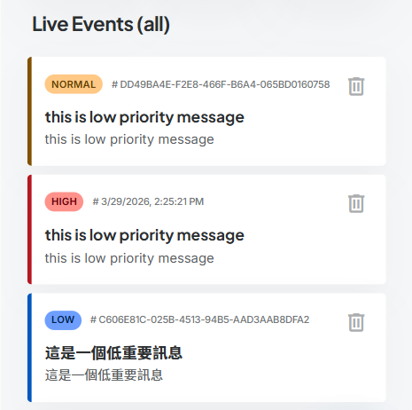
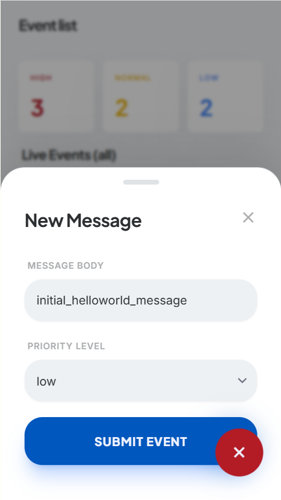
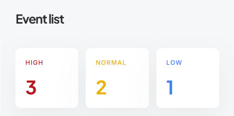
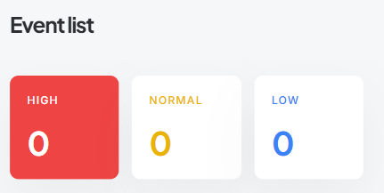
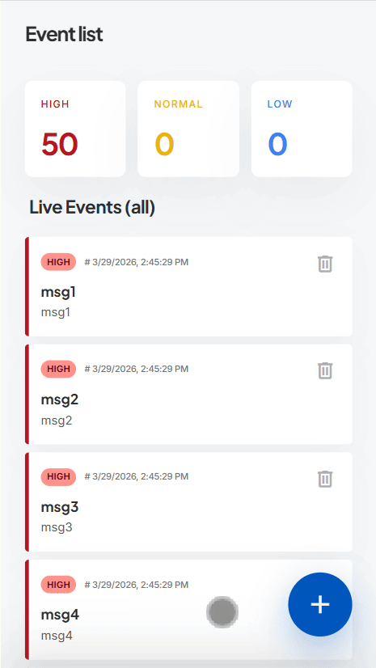

# yid_skcor challenge

yid_skcor challenge, the name like this was for security purpose. please do ask me when you want to know more.

Submission:
Public Git repository with a clear README explaining setup and your decisions.

## 1 Code Review & Refactoring

Q: Identify as many issues as you can (aim for at least 8)

A: done.

Q: For each issue: explain what is wrong, why it matters, and how you would fix it

A: done, please see the delta of `./Q1/script_ur.js` (under review) and `./Q1/script.js` (after review). please come to me if you want to have a verbose answer.

Q: Then refactor the code into a version you would be comfortable shipping to production

A: done, plesae take a look to `./Q1/script.js`.

Q: Write your analysis in a REVIEW.md file in the repo

A: done

> What we are evaluating:
>
> 1. Can you read and reason about code you didn’t write?
> 1. Do you understand AngularJS patterns deeply enough to spot subtle issues?
> 1. Can you articulate why something is a problem, not just that it is?
> 1. Is your refactored version genuinely better, or just differently formatted?

---

## 2 Feature Implementation with Constraints

### Requirements

1. **Backend (Node.js)**

   • REQ_001: An endpoint POST /events that accepts an event with fields:
   - type (string),
   - message (string),
   - priority (“low”, “normal”, “high”)

   • REQ_002: Events are stored in memory (no database required)

   • REQ_003: A maximum of 50 events are kept
   - when a new event arrives and the buffer is full, the oldest
     low-priority event is dropped first.
   - If no low-priority events exist, drop the oldest normal. High-priority
     events are never dropped
   - if the buffer is full of only high-priority events, reject the new event with a 429

   • REQ_004: New events are pushed to connected frontends in real-time (your choice: WebSocket, SSE, or polling)

   • REQ_005: An endpoint GET /events returns the current buffer, sorted by timestamp descending

1. **Frontend (AngularJS)**

   • REQ_01: Display the live event feed, updating in real-time as new events arrive

   

   • REQ_02: Visually distinguish events by priority (your design choice — just make it clear)

   

   • REQ_03: A form to submit new events manually

   

   • REQ_04: Show a count of events by priority

   

   

   • REQ_05: Handle the 429 case gracefully in the UI

   

## 3 changelog

- 2026-03-29: update frontend styling

## Further help

to get more information on this project please find louis (https://louiscklaw.github.io).
